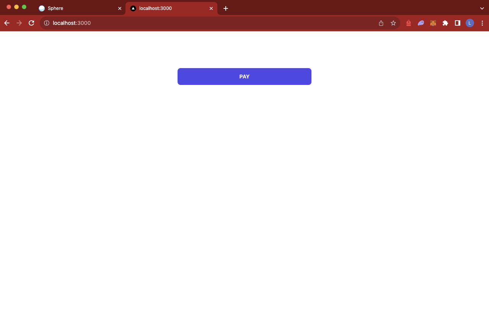

## Sphere Labs

<div align="center">
    <a>
        
    </a>
  <h1 style="margin-top:20px;">Directly use the API to create your own frontend</h1>
</div>

# Overview

This is an example Next.js app, demonstrating how to use the API directly to embed a Sphere payment button into your app.

More generally, it shows how to use the API to create your own frontend payments flow, using Sphere for backend payments processing.

This repository will be useful to you if you:

1. Want to build your own custom checkout pages, or embed a pay button into your application.
1. Don't want to use Sphere's pre-built checkout pages.
1. Want to minimize dependencies by foregoing use of the `@spherelabs/react` library.

# Setup

First, create a payment metho (e.g., payment link) via the Sphere API or dashboard. 

Export the paymentLink_id as an environment variable, as shown below, to connect the payment button to your Sphere account:

```bash
export NEXT_PUBLIC_PAYMENT_LINK_ID="paymentLink_51ae9e9aa1684340ae969bc1b23f540d"
```

# Installation

Run once:

```bash
yarn
```

# Development

To start the server on port :3000 run:

```bash
yarn run dev
```

Navigating to `http://localhost:3000` will give:

<div align="center">

</div>

## Notes:

It is generally recommended to use the React SDK, `@spherelabs/react` when possible. Refer to `nextjs-react-sdk` for example usage.
